# Congress Connect - Process Flow Documentation

This document provides visual representations of the application's architecture, data flows, and user interactions.

---

## 1. User Journey Flow

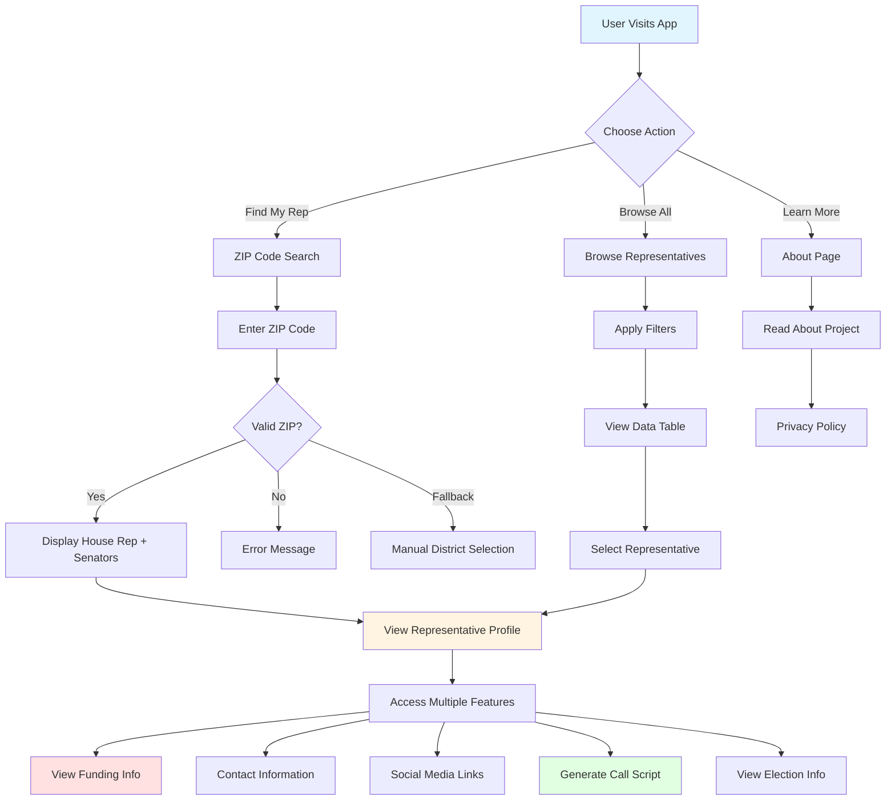

---

## 2. Technical Architecture Flow

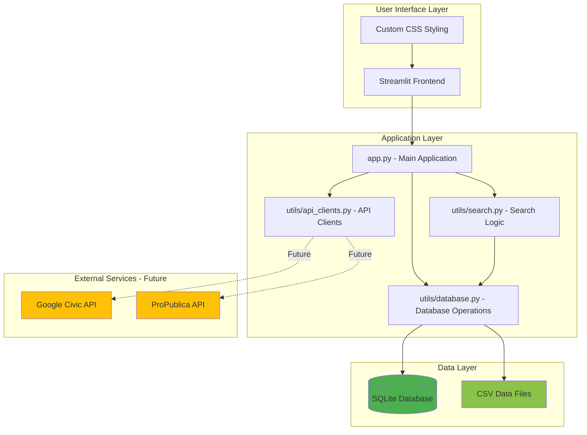

---

## 3. Data Flow Architecture

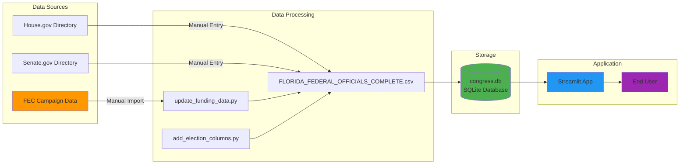

---

## 4. ZIP Code Search Process

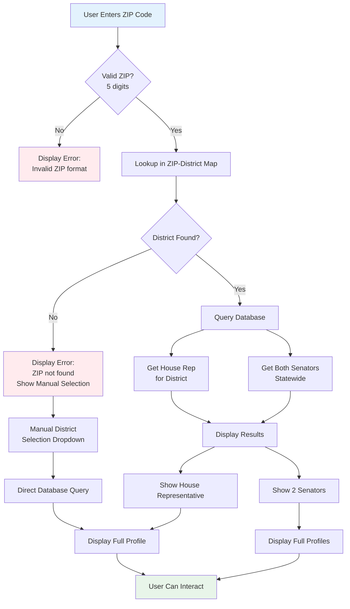

---

## 5. Database Query Flow

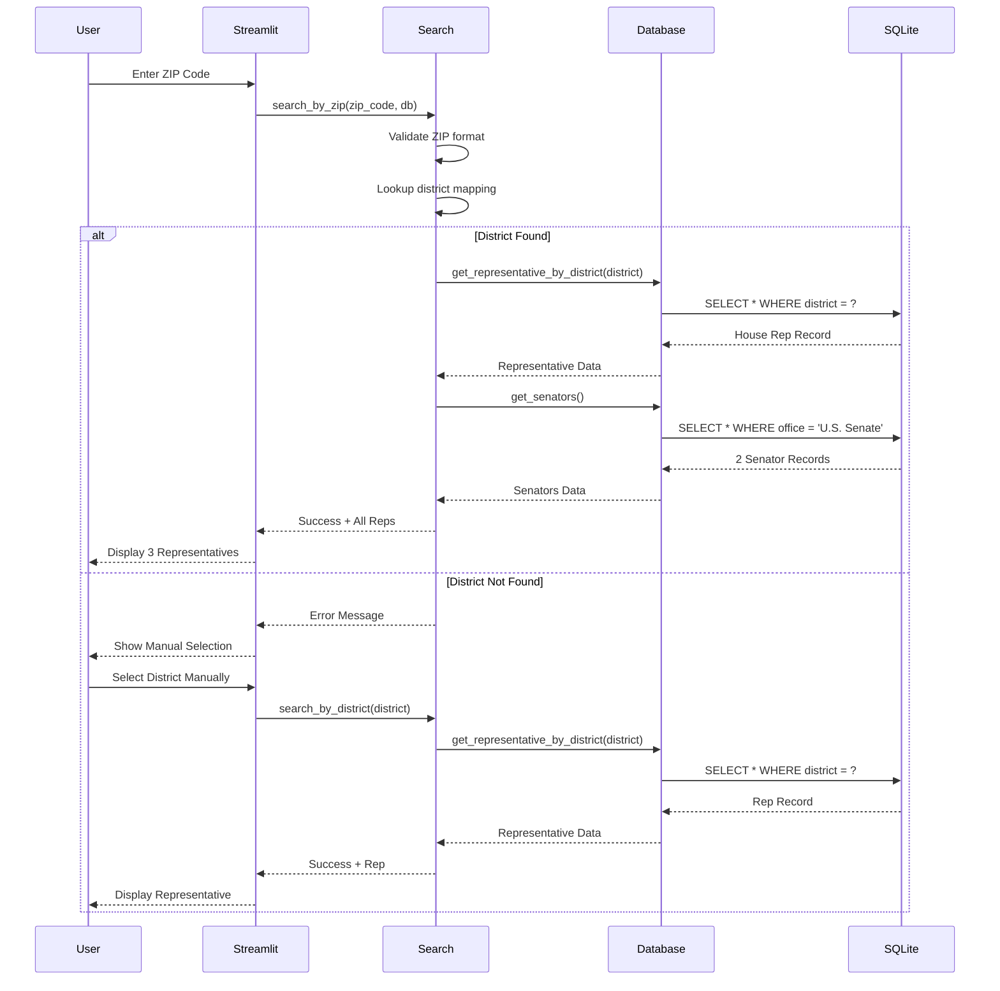

---

## 6. Representative Profile Display Flow

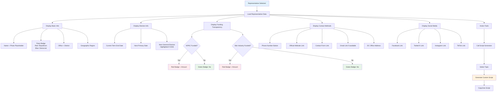

---

## 7. Browse & Filter Flow

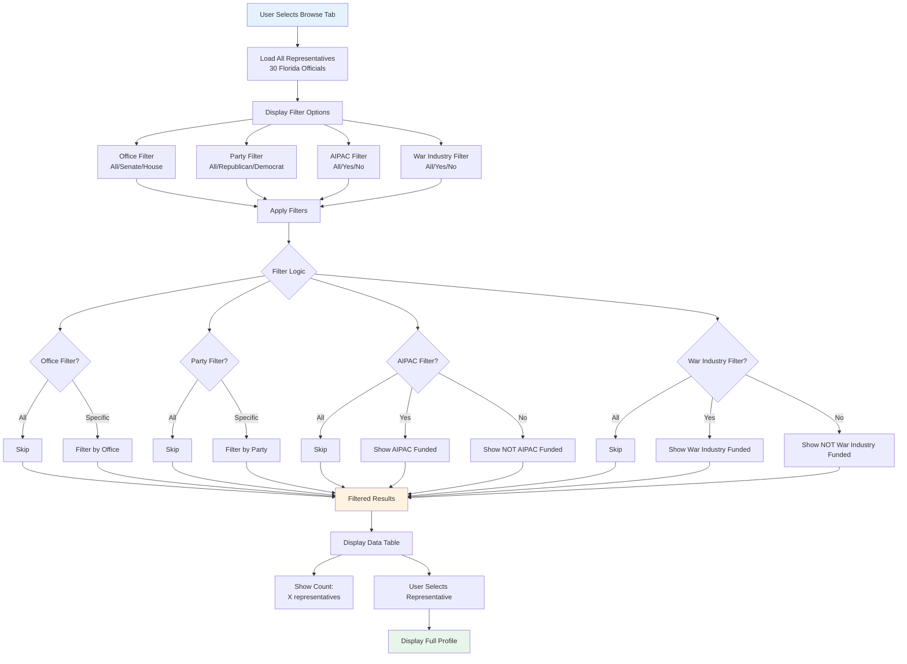

---

## 8. Call Script Generator Flow

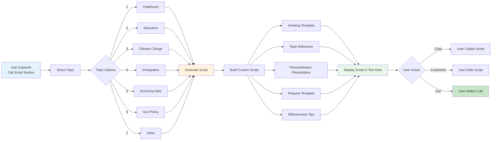

---

## 9. Data Update Pipeline

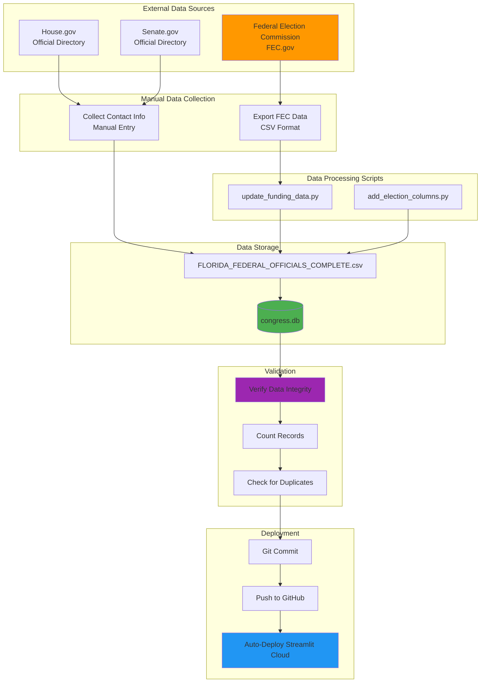

---

## 10. Privacy-First Architecture

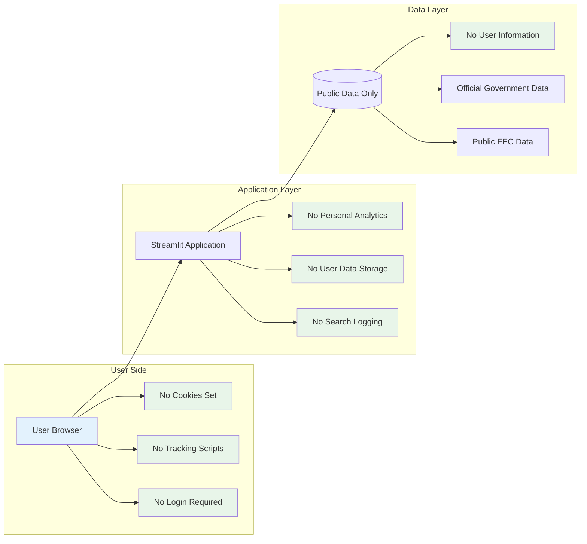

---

## Key Features Summary

### User-Facing Features
1. **ZIP Code Lookup** - Instant representative search
2. **Browse & Filter** - Explore all 30 Florida officials
3. **Funding Transparency** - AIPAC and War Industry funding data
4. **Election Information** - 2026 election dates and term limits
5. **Contact Methods** - Phone, email, web forms, social media
6. **Call Script Generator** - Customizable call scripts for civic engagement
7. **Mobile Responsive** - Works on all devices

### Technical Features
1. **Privacy-First** - Zero personal data collection
2. **Fast Performance** - SQLite database with indexed queries
3. **Offline Capable** - Static data, no external API dependencies (currently)
4. **Free Hosting** - Streamlit Community Cloud
5. **Open Source** - GitHub repository
6. **Easy Updates** - CSV-based data management

### Data Features
1. **30 Representatives** - 2 Senators + 28 House Members
2. **25 with Funding Data** - Real FEC 2023-2024 campaign data
3. **Election Dates** - 2026 primary and general elections
4. **Contact Information** - Phone, email, websites, social media
5. **Geographic Coverage** - All Florida districts

---

## Performance Metrics

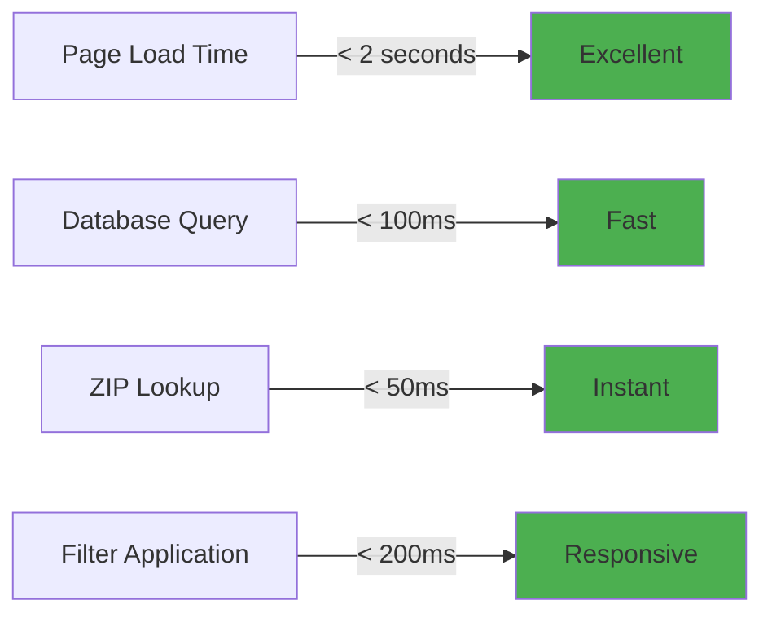

---

## Deployment Flow

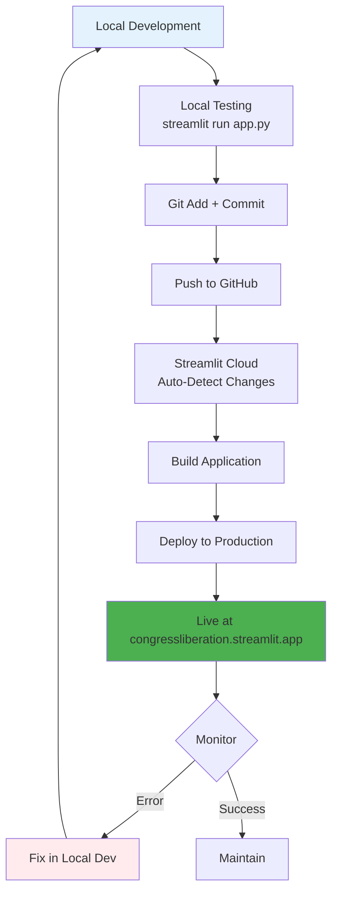

---

## Future Enhancements (Planned)

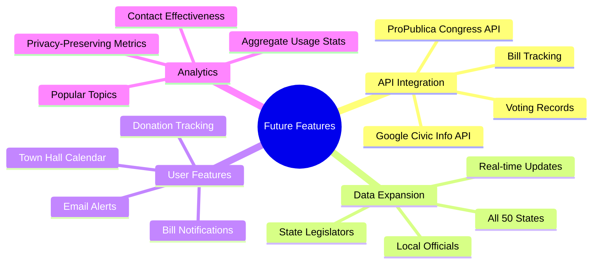

---

**Document Version:** 1.0
**Last Updated:** October 29, 2025
**Application Version:** Production MVP
**Live URL:** https://congressliberation.streamlit.app
